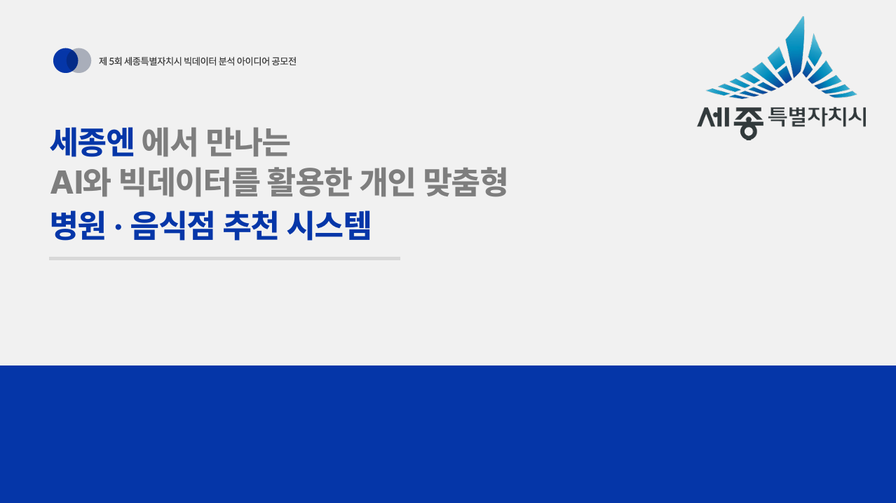

# 🌟 세종시 공모전 Project : 세종엔에서 만나는 AI와 빅데이터를 활용한 개인 맞춤형 병원 · 음식점 추천 시스템

### 프로젝트 발표 자료
- 프로젝트의 전체 내용은 아래 PDF 파일에서 확인할 수 있습니다. 
 
  👉 [발표 자료 다운로드 - pdf](https://github.com/Kim-Jun-Hee/project3/blob/main/세종시공모전포트폴리오.pdf)  
  
📥 **다운로드 안내**  
💡 **PDF**: 오른쪽 상단의 다운로드 버튼을 누르면 다운로드가 가능합니다.  
  

### 📂 프로젝트 목표
- 세종시 스마트도시 발전을 위한 '세종엔' 탐색 및 개선 방안 도출
- 아픈 부위를 입력하면 병원을 추천하는 AI 챗봇 제작
- 사용자 취향에 맞는 음식점을 추천하는 웹 플랫폼 개발
  

### 📅 프로젝트 기간
- 2024.09.02 ~ 2024.09.30
  

### 프로젝트 인원 및 역할
- 총인원: 4명
- 개인 작업: 병원 및 음식점 크롤링 데이터 전처리,병원 추천 챗봇 제작,음식점 및 병원 홈페이지 통합
- 공동 작업: ppt제작
  

### 사용된 기술 및 도구

#### 💻 주요 기술
 **python**

#### 🛠️ 도구 

  
  
  
  

### 🏆 주요 결과물
<table>
  <tr>
    <td align="center">🌟 코로나 유무에 따른 유아용품 물류량의 상관관계</td>
    <td align="center">🌟 영유아 수 및 혼인 건수 와 유아용품 물류량과의 다중 회귀분석</td>
  </tr>
  <tr>
    <td>
      
    </td>
    <td>
      
    </td>
  </tr>
  <tr>
    <td align="center">🌟 명절과 물류량의 관계</td>
    <td align="center">🌟 오배송 발생 현황 파악</td>
  </tr>
  <tr>
    <td>
      
    </td>
    <td>
      
    </td>
  </tr>
</table>
